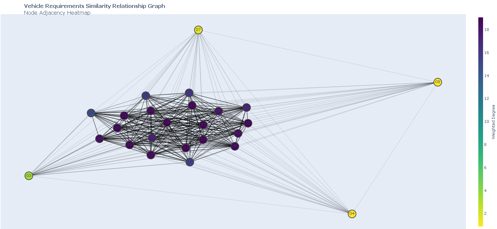

# Requirements Modeling

## Download and Installation
*Only the SpecRelations folder is needed for usage. All other files are deprecated and their functionality is being
migrated to the SpecRelations files. Once migration is complete, they will be removed from the repo.

Pip is not currently supported. Therefore, to install the package locally, either download the repo as zip file or clone
to local machine (green button at top of GitHub repo page). DO NOT PUT ENTIRE REPO IN PYTHON PATH.

Once downloaded/cloned, add /path/to/SpecRelations to your PYTHON PATH. It is recommended that a virtual environment be
used to prevent dependency conflicts.

## Usage
The ``SpecRelations`` package is based around the ``System`` class. This stores all attributes associated with the
system being designed. To create a ``System`` instance, a name must be provided, along with a requirements document.

At the moment, the software treats a requirements document as immutable. There are not currently methods for modifying
the document within the same session. The assumption is made that the package is used to analyze graphs for a given
document, not to modify the document.

In initializing the ``System`` instance, the provided document will be parsed and processed automatically so that the
graphs and other attibutes may all be interacted with immediately. Multiprocessing is leveraged to reduce the run time
of this instantiation. Progress is output to the terminal during this operation.

### Creating a ``System`` instance
The program:
```Python
from SpecRelations import system
filepath = ("FMTV_Requirements_partial.txt")
with open(filepath, "r") as f:
    doc_txt = f.read()
vehicle = system.System("Vehicle", doc_txt)
```
```
Processing section 3.1. System Definition.
Processing section 3.2. Vehicle Characteristics.
Processing section 3.2.1. Performance Characteristics.
Processing section 3.2.1.1. Grade Operation.
---(truncated)---
```

Now we can view the list of requirements using:
```Python
>>> vehicle.print_requirements_list()

```
```
00) The basic chassis and models of the FMTV hereinafter referred to as the vehicle shall be comprised of components, parts and accessories which meet or exceed the requirements of this specification and shall consist of chassis capable of accepting various body configurations to accommodate vehicle missions.

01) All vehicles shall meet all requirements in all sections of this ATPD (unless otherwise indicated) in addition to the specific requirements in the respective annex for each model.

---(truncated)---
```

Or we can view the document structure using:
```Python
>>> vehicle.print_document_tree()
```
```
REQUIREMENTS DOCUMENT TREE
   System Definition
   Vehicle Characteristics
      Performance Characteristics
         Grade Operation
         Side Slope Operation
         Steering And Handling
         Speed
---(truncated)---
```

Output is printed to the terminal.


### Viewing Graphs
Once the system is instantiated, visualize the graphs with:
```Python
>>> vehicle.show_graphs()
```

This defaults to displaying all available relationship graphs and they will all be fully connected.

To display the graph for a subset of the available relationships, use the keyword argument ``relations``:
```Python
>>> vehicle.show_graphs(relations=['keyword', 'similarity'])
```


For a full list of available relations, use ```print_relation_types```:

```Python
>>> vehicle.print_relation_types()
```
```
keyword | similarity | contextual
```

### Analyzing Graphs
To perform analysis on the available graphs, we can return them as networkX Graph objects which allows for any of the networkX methods and algorithms to be used.

To do this, we use the ```get_relation_graph``` method for the system instance and provide with the desired relation type.

```Python
>>> kw_graph = vehicle.get_relation_graph('keyword')
>>> import networkx as nx
>>> nx.closeness_centrality(kw_graph)
```
```
{
    0: 1.0,
    1: 1.0,
    2: 1.0,
    3: 1.0,
    5: 1.0,
    6: 1.0,
    7: 1.0,
    9: 0.8571428571428571,
    10: 1.0,
    ...
}
```

